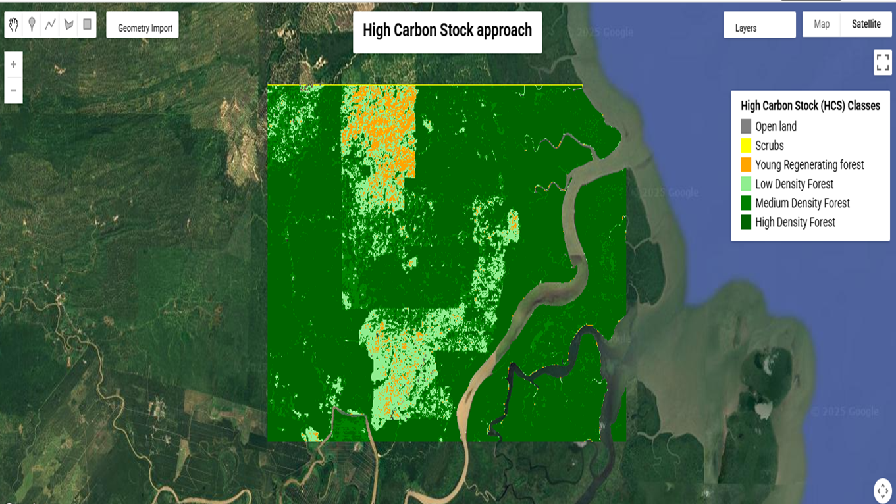
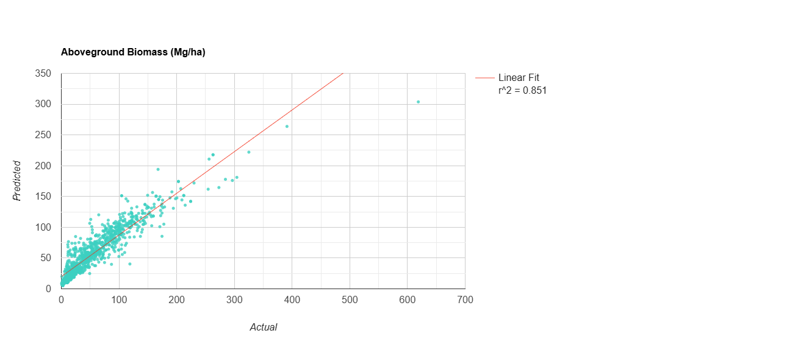

# 🌳 High Carbon Stock Estimation using Satellite Embeddings and GEDI in Sabah, Malaysia

This project estimates **Aboveground Biomass Density (AGB)** and identifies **High Carbon Stock (HCS)** areas in the **Sabah region of Malaysia** using:

- Google DeepMind’s Satellite Embeddings dataset
- NASA’s GEDI L4A Biomass product
- Random Forest regression model
- Google Earth Engine (GEE)

---

- Link to app : https://sanjaymanjappa25.users.earthengine.app/view/high-carbon-stock

---

## 🚀 Overview

Carbon-rich tropical forests are crucial for climate stability. This project leverages state-of-the-art machine learning and geospatial data to map AGB, enabling data-driven conservation and forest management efforts in Southeast Asia.

We use:
- **Satellite image embeddings** (by Google DeepMind) that encode multi-sensor and temporal information.
- **GEDI biomass estimates** as ground truth to train the model.
- **Random Forest** for regression modeling of AGB.
- **GEE** for data preprocessing, modeling, and visualization.

---

## 🗺️ Study Area

- 📍 **Sabah**, Malaysian Borneo  
- A region known for rich tropical forests and facing deforestation pressures.

---

## 🧠 Methodology

1. **Preprocessing:**
   - Load and filter GEDI and satellite embeddings over the AOI (Sabah).
   - Filter GEDI data using quality flag and AGB standard error.

2. **Model Training:**
   - Train a Random Forest model to predict `AGB` from embeddings.

3. **Prediction and Mapping:**
   - Predict AGB across the region using trained model.
   - Visualize results as raster maps.
   - Categorize AGB into **HCS classes** (e.g., 0, <20, 20–35, 35–60, 60–100, >100 Mg/ha).

4. **Validation:**
   - Calculate RMSE and R square.

---

## 📊 Output Layers

- `AGB_Predicted`: Continuous AGB estimate (Mg/ha)
- `HCS_Classes`: Discrete high carbon stock classes (0–5)
- `Land cover`: Land cover-filtered AGB maps using ESA World cover data to mask out the non essential land cover classes

---

## 🤝 Acknowledgments

- Google DeepMind for the open embeddings and tutorials
- NASA GEDI mission team
- ESA WorldCover project

---

## 📬 Contact
Author:
**Sanjay Manjappa**  
📧 [sanjaymanjappa25@gmail.com]  
